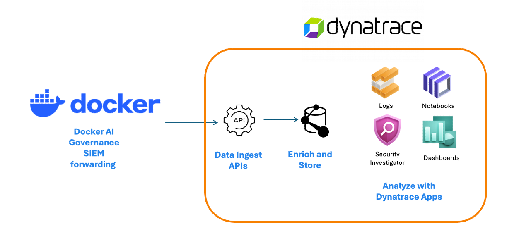
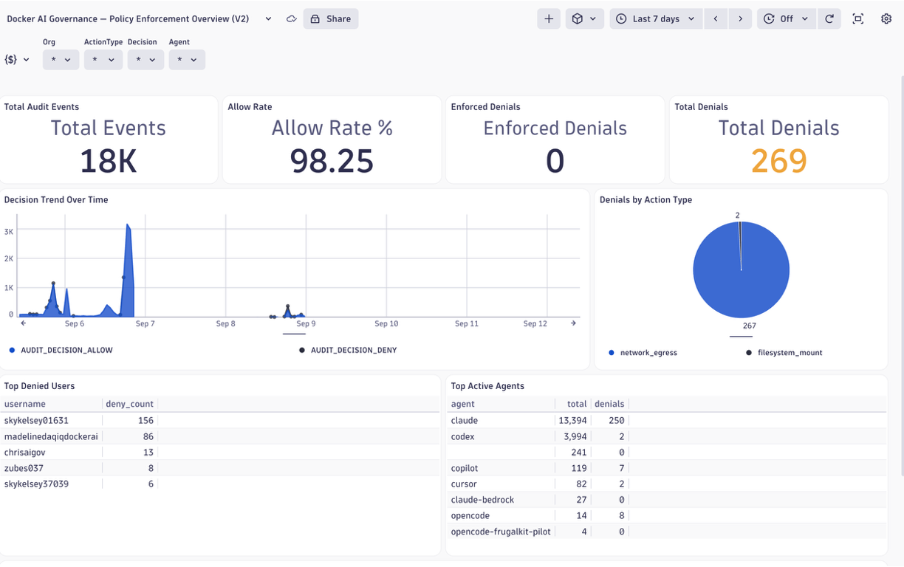
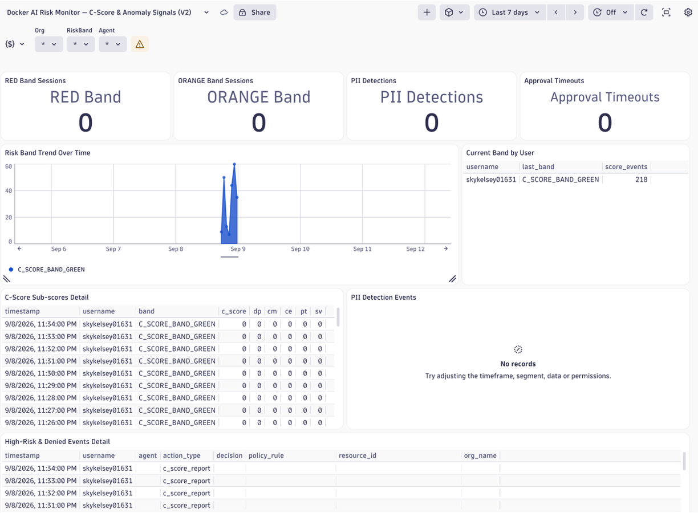

# Overview

> **Docker SIEM Integration Docs:** [https://docs.docker.com/ai/sandboxes/governance/audit/siem/](https://docs.docker.com/ai/sandboxes/governance/audit/siem/)



Docker Sandbox Governance Audit Logs arrive as raw JSON. This OpenPipeline parser enriches each event with named attributes (`docker.audit.*`, `loglevel`, `log.source`) so you can filter and alert directly in DQL without parsing `content` on every query — and the included dashboards work out of the box.

* See [DOCKER-PARSER-V2.md](DOCKER-PARSER-V2.md) for field-level detail on the parser.
* See below for installation instructions.

### Policy Enforcement Dashboard

Tracks allow/deny decision rates, enforcement mode, denied actions and users, policy rule hit frequency, and a full event detail log — giving you visibility into how governance policies are being applied across Docker AI Sandbox sessions.



### Risk Monitor Dashboard

Surfaces C-Score risk band distribution (RED/ORANGE sessions), PII detection events, approval timeouts, and per-user risk band breakdowns — highlighting the highest-risk sessions and anomalous AI behavior for investigation.



---

## Dynatrace Configuration

### Platform Token

* Platform tokens are created in [Dynatrace Account Management](https://myaccount.dynatrace.com) — not inside the tenant settings.
* Required scope: `openpipeline:logs:ingest`
* References: [Log Ingest API authentication](https://docs.dynatrace.com/docs/dynatrace-api/environment-api/log-monitoring-v2/post-ingest-logs#openapi-authentication-post-logsingest)

### Docker SIEM configuration

Configure Docker to forward audit logs to Dynatrace by setting the ingest endpoint URL and authorization header. The `dt.ingest.origin` query parameter tags every event in the batch for filtering and routing without modifying individual records.

**Ingest URL:**
```
https://<your-environment-id>.live.dynatrace.com/api/v2/logs/ingest?dt.ingest.origin=docker-sandbox-auditlogs
```

**Authorization header:**
```
Authorization: Bearer <platform-token>
```

Query with DQL once logs are flowing:

```dql
fetch logs
| filter dt.ingest.origin == "docker-sandbox-auditlogs"
```

---

## Dynatrace Configuration

## Step 0: Install dtctl that is used to deploy Dynatrace configuration

[dtctl](https://dynatrace-oss.github.io/dtctl/) is a kubectl-inspired CLI for managing Dynatrace resources. Install it following the [installation guide](https://dynatrace-oss.github.io/dtctl/docs/installation/).

### dtctl Authentication

Recommended way is just use OAuth Login for Browser-based SSO login with automatic token 

```bash
dtctl auth login --context my-env --environment "https://abc12345.apps.dynatrace.com"
```
[dtctl Documentation](https://dynatrace-oss.github.io/dtctl/docs/configuration)

---

## Step 2: Install Pipeline (first time)

There is one pipeline and the YAML file has no `id` field — `apply` creates a new dashboard. Do not add an `id` before committing so the files remain environment-agnostic.

```bash
dtctl create settings --schema builtin:openpipeline.logs.pipelines --scope environment -f pipeline-docker-v2.json --plain
```

If you need to update after install use the `update` command. BUT, the `update` command requires the `objectId` of the already-installed pipeline. Use `jq` to extract it by `customId` and inject it:

```bash
OBJECT_ID=$(dtctl get settings --schema builtin:openpipeline.logs.pipelines --scope environment -o json --plain | jq -r '.[] | select(.value.customId == "extension:docker-sandbox-audit-log-v2") | .objectId')
jq --arg id "$OBJECT_ID" '. + {objectId: $id}' pipeline-docker-v2.json > pipeline-with-id.json
dtctl update settings --schema builtin:openpipeline.logs.pipelines --scope environment -f pipeline-with-id.json --plain
```

See [dtctl apply vs update](https://dynatrace-oss.github.io/dtctl/docs/documents/#apply-vs-update-document) for the distinction between `apply` (create-or-update) and `update` (fails if absent).

---

## Step 3: Configure Dynamic Route in OpenPipeline

Create a route to direct incoming Docker audit logs to the pipeline installed in Step 2.

In Dynatrace go to **Settings > Process and contextualize > OpenPipeline > Logs > Pipelines > Dynamic route** and add a new route with:

| Field | Value |
|---|---|
| Name | `Docker Sandbox Audit Logs` (or your choice) |
| Matching condition | `dt.ingest.origin == "docker-sandbox-auditlogs"` |
| Target pipeline | The pipeline installed in Step 2 |

See [OpenPipeline routing documentation](https://docs.dynatrace.com/docs/platform/openpipeline/get-started/how-to-routing) for full details.

--- 
## Step 4: Install Dashboards (first time)

There are two dashboards:

| File | Description |
|---|---|
| `docker-dashboard-policy-enforcement-v2.yaml` | Decision rates, enforcement mode, denied actions and users, policy rule frequency, event detail |
| `docker-dashboard-risk-monitor-v2.yaml` | C-Score risk bands, PII detection, approval timeouts, high-risk session detail |

The YAML files have no `id` field — `apply` creates a new dashboard. Do not add an `id` before committing so the files remain environment-agnostic.


```bash
dtctl apply -f docker-dashboard-policy-enforcement-v2.yaml --plain
dtctl apply -f docker-dashboard-risk-monitor-v2.yaml --plain
```

If you need to update an existing dashboard, the `update` command requires the dashboard `id`. Use `jq` to extract it by name and inject it:

```bash
DASHBOARD_ID=$(dtctl get dashboard -o json --plain | jq -r '.[] | select(.name == "Docker AI Policy Enforcement") | .id')
jq --arg id "$DASHBOARD_ID" '. + {id: $id}' docker-dashboard-policy-enforcement-v2.yaml > dashboard-with-id.yaml
dtctl update dashboard -f dashboard-with-id.yaml --plain
```

## Step 5: View Data

Once steps 1-4 are complete, you can open the dashboards to review data. 

You can develop your own queries in a notebook with DQL

Query with DQL once logs are flowing:

```dql
fetch logs
| filter dt.ingest.origin == "docker-sandbox-auditlogs"
```